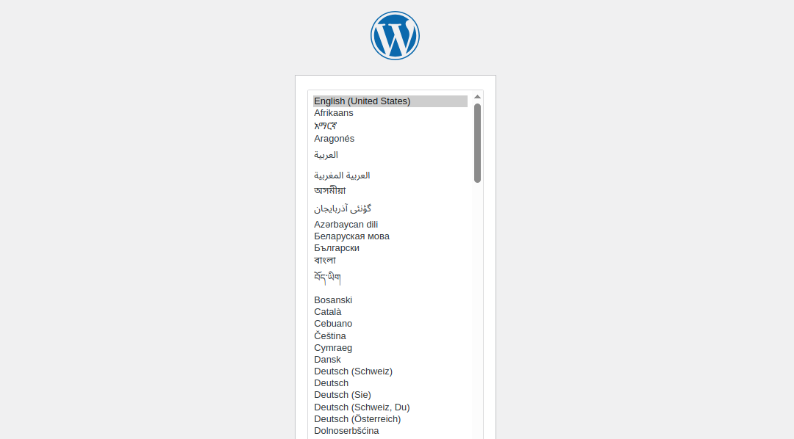

# WordPress on Kubernetes

A production-ready WordPress deployment for Kubernetes that's simple to deploy with Kustomize.

## ✨ Features
- **Scalable**: Horizontally scale WordPress pods based on demand
- **Persistent**: Durable storage for both WordPress files and MySQL database
- **Customizable**: Easily configure resources, replicas, and environment variables
- **Ingress-enabled**: Pre-configured for external access with customizable hostname
- **Database-ready**: MySQL deployment with proper initialization and backup capabilities
- **Secure**: Secret management for database credentials

## 🏗️ Architecture

This deployment consists of:
- WordPress deployment with configurable compute resources
- MySQL database with persistent storage
- Persistent volume claims for both WordPress and MySQL
- Kubernetes Services for internal networking
- Ingress configuration for external access
- Kustomize overlays for environment-specific configurations (dev, staging, prod)
- ConfigMap for Nginx customization

## 📋 Prerequisites

- Kubernetes cluster (v1.25+)
- kubectl configured to communicate with your cluster
- Kustomize (v4.0+)
- Storage class available in your cluster for persistent volumes
- DNS record pointing to your Kubernetes ingress (for production use)

## 🔧 Installation Guide

### 1. Namespace Setup

Create a dedicated namespace for WordPress:

```bash
kubectl create namespace wordpress
```

### 2. Clone the Repository

```bash
git clone https://github.com/yourusername/wordpress-kubernetes.git
cd wordpress-kubernetes
```

### 3. User and Directory Setup

Create a WordPress user and required directories for persistent storage:

```bash
# Create WordPress user
sudo adduser wordpress

# Note the UID and GID for later configuration
id wordpress
# Example output: uid=1015(wordpress) gid=1015(wordpress) groups=1015(wordpress),100(users)

# Create persistent storage directories
mkdir -p /home/wordpress/data /home/wordpress/mysql
chown -R wordpress:wordpress /home/wordpress
```

### 4. Configure Your Deployment

#### 4.1 Update Security Context

Edit `base/deployment.yaml` to use your WordPress user's UID/GID:

```yaml
securityContext:
  fsGroup: 1015  # Replace with your WordPress user's GID
  runAsUser: 1015  # Replace with your WordPress user's UID
```

#### 4.2 Configure Your Domain

Update the Ingress configuration in `base/ingress.yaml`:

```yaml
spec:
  rules:
    - host: your-actual-domain.com  # Replace wordpress.example.com with your domain
```

#### 4.3 Update Database Secrets

Edit the base64-encoded values in `base/mysql-secret.yaml`:

```bash
# Generate base64 values for your credentials
echo -n "your-username" | base64
echo -n "your-secure-password" | base64
```

Replace the placeholders in the file with your encoded values.

### 5. Deploy Using Kustomize

For development environment:
```bash
kubectl apply -k overlays/dev
```

For production environment:
```bash
kubectl apply -k overlays/prod
```

### 6. Verify Your Deployment

```bash
# Check if all pods are running
kubectl get pods -n wordpress

# Verify services are created
kubectl get svc -n wordpress

# Confirm ingress is configured
kubectl get ingress -n wordpress
```

## 🔍 Post-Installation Setup

After successful deployment, complete your WordPress configuration:

1. Navigate to your configured domain (e.g., `https://your-actual-domain.com`)

2. Choose your preferred language

3. Complete the "5-minute setup":
   - Enter your site title
   - Create an admin username and password
   - Provide your email address
   - Choose search engine visibility settings

   

### Initial WordPress Optimization

After installation, consider implementing these best practices:

- **Security plugins**: Install and configure Wordfence or Sucuri for enhanced security
- **Caching**: Set up a caching plugin like W3 Total Cache or WP Super Cache
- **SEO**: Configure Yoast SEO or Rank Math for better search visibility
- **Performance**: Install Smush or ShortPixel for image optimization
- **Backup**: Configure UpdraftPlus or BackupBuddy for regular backups
- **Forms**: Add Contact Form 7 or WPForms for contact pages
- **Analytics**: Connect to Google Analytics via a plugin
- **CDN**: Configure Cloudflare or another CDN for better performance

## ⚠️ Troubleshooting

### Permission Issues

If WordPress fails to start or you see permission errors:

1. **Verify user setup**:
   ```bash
   id wordpress
   ```

2. **Check directory permissions**:
   ```bash
   ls -la /home/wordpress/
   ```

3. **Ensure values match** in your deployment YAML:
   ```yaml
   securityContext:
     fsGroup: YOUR_WORDPRESS_GID
     runAsUser: YOUR_WORDPRESS_UID
   ```

4. **Check pod logs**:
   ```bash
   kubectl logs -n wordpress deployment/wordpress
   ```

5. **Check if the standard storage class exists in the cluster; if not, create the storage class**
    ```bash
    kubectl get storageclass
    NAME                   PROVISIONER                    RECLAIMPOLICY   
    local-path (default)   rancher.io/local-path          Delete          
    local-storage          kubernetes.io/no-provisioner   Retain          
    standard               rancher.io/local-path          Delete          
    ```

### Database Connection Issues

If WordPress can't connect to MySQL:

1. **Check if MySQL pod is running**:
   ```bash
   kubectl get pods -n wordpress -l app=mysql
   ```

2. **Verify secret configuration**:
   ```bash
   kubectl describe secret mysql-secret -n wordpress
   ```

3. **Check MySQL logs**:
   ```bash
   kubectl logs -n wordpress deployment/mysql
   ```

## 🔍 Environment Details

This deployment has been successfully tested with:

```bash
$ kubectl version
Client Version: v1.31.4+k3s1
Kustomize Version: v5.4.2
Server Version: v1.31.4+k3s1
```

## 📄 License

MIT

## 🤝 Contributing

Contributions are welcome! Please feel free to submit a Pull Request.

1. Fork the repository
2. Create your feature branch (`git checkout -b feature/amazing-feature`)
3. Commit your changes (`git commit -m 'Add some amazing feature'`)
4. Push to the branch (`git push origin feature/amazing-feature`)
5. Open a Pull Request